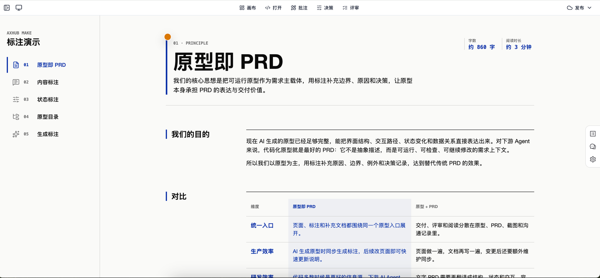
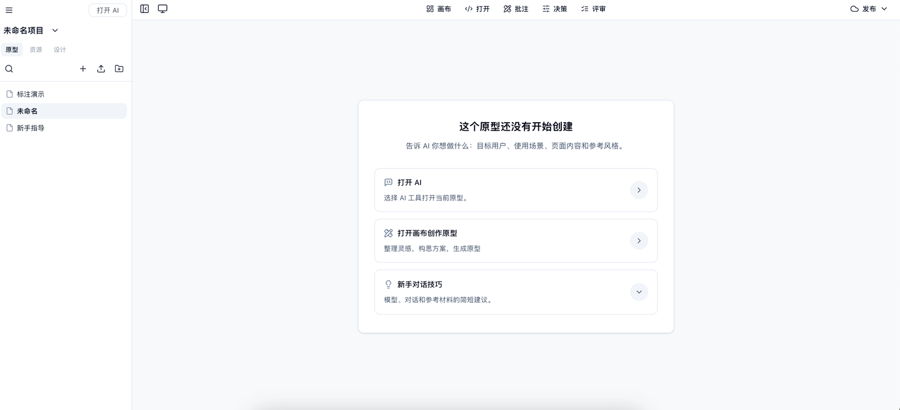
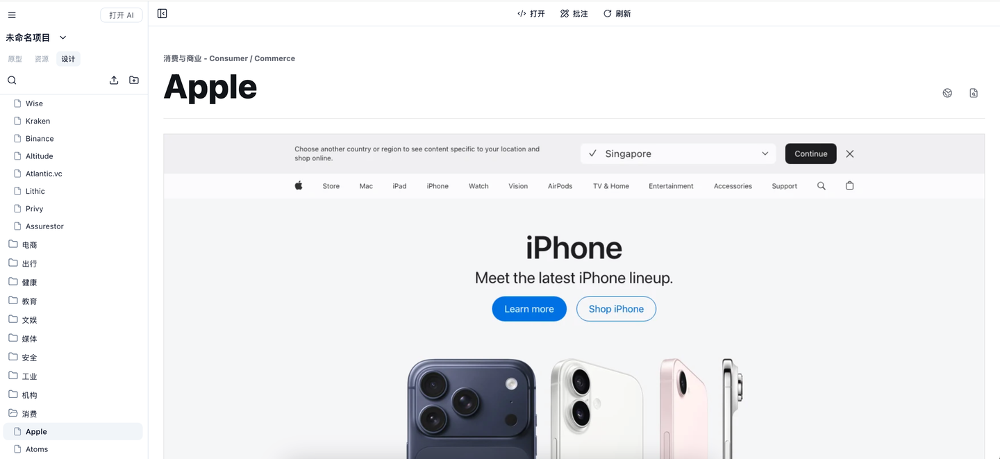

# Axhub Make

> Axhub Make 不是“又一个 AI 生成页面工具”。
> 它是一条从 **需求分析** 到 **原型生成**、**批注微调**、**原型评审**，再到 **发布交付** 的 AI 产品工作流。

给产品、设计师、业务团队和 AI Agent 用。

你说清楚要什么，Make 会把它变成：

- 可以点击、可以评审、可以发布的交互原型
- 带批注、标注和业务说明的“活 PRD”
- 基于设计系统和专业技能生成的 UI/UX 方案
- 面向新手的免费教程和上手路径
- 可分享、可导出、可交付的原型成果

官网：[https://axhub.im/make/](https://axhub.im/make/)

## 直接启动

在你的项目目录里运行：

```bash
npx -y @axhub/make@latest
```

启动后会自动打开管理页面。如果没有打开，复制终端里显示的地址到浏览器。

## 发布后的使用方式

发布到 npm 后，用户不需要手动 clone 本仓库；在项目目录里执行 `npx -y @axhub/make@latest` 就会启动 Axhub Make 管理服务器。

当用户在管理页面里创建原型项目时，Make 会从 GitHub 拉取官方客户端模板代码：

```text
https://github.com/lintendo/Axhub-Make/tree/main/client
```

拉取完成后，本地会生成一个可运行的 Make Client 项目，用来承载后续创建的原型、主题、项目资料和预览运行时。

面向用户的运行环境要尽量保守：需要兼容 macOS、Windows 和 Linux，也要考虑用户本机没有 Git 或 pnpm 的情况。Make 管理服务器和生成的 Client 项目在非开发场景不要强制依赖 pnpm；启动、安装和自检流程优先使用用户更容易具备的 `npm` / `npx`。

## 让 AI 帮你启动

把下面这段发给你的 AI Agent，让它帮你检查环境、启动 Make，并创建一个以后可以直接双击运行的桌面脚本：

```text
请帮我在当前项目目录启动 Axhub Make，并确保以后可以一键启动。

目标命令：
npx -y @axhub/make@latest

请按下面要求执行：

1. 先检查当前环境是否可以直接执行 `npx -y @axhub/make@latest`。
2. 如果命令失败，不要停在报错处。请判断原因并处理，直到这个命令可以直接执行：
   - 检查 Node.js、npm、npx 是否可用；
   - 如果缺少依赖，请按当前操作系统安装或引导我安装；
   - 如果是网络、权限、缓存、PATH、Node 版本或 npm 配置问题，请修复或给出可执行命令；
   - 每次修复后重新运行 `npx -y @axhub/make@latest` 验证。
3. 启动成功后，确认管理页面已经打开；如果没有自动打开，请把终端里的访问地址复制给我。
4. 在我的桌面创建一个启动脚本，用来以后直接启动 Axhub Make：
   - macOS/Linux：创建可双击或可执行的 `.command` 或 `.sh` 脚本；
   - Windows：创建 `.bat` 或 `.cmd` 脚本；
   - 脚本需要进入当前项目目录，然后执行 `npx -y @axhub/make@latest`。
5. 创建脚本后，请实际运行一次脚本，确认脚本可以正确启动 Axhub Make。
6. 最后告诉我：
   - Axhub Make 的访问地址；
   - 桌面脚本的完整路径；
   - 如果后续要手动启动，应该双击哪个脚本。
```

## 核心特点

| 特点 | 说明 |
| --- | --- |
| 原型生产全链路 | 从需求分析、原型生成、批注编辑、原型评审到发布交付，覆盖产品想法落地的完整闭环。 |
| 原型即 PRD | 用可运行页面承载流程、状态、字段、交互和业务说明，让需求不再散落在文档、截图和聊天记录里。 |
| 免费资源库 | 内置新手教程、100+ 设计规范和 10+ 行业原型，帮助团队从模板、规范和案例直接起步。 |
| 最强发布交付 | 支持云服务发布、HTML 导出、Figma 交付，以及独家 Axure 发布链路，满足评审、分享和正式交付。 |
| 产品团队工作台 | 开源可自定义，支持多人协作和远程工作，把产品、设计、研发与 AI Agent 放在同一个项目上下文里。 |

## 界面演示







## 用户群

扫码加入 Axhub Make 用户群，获取使用交流、问题反馈和新版本动态。

如果你已经加入过 Axhub 其他用户群，不需要重复添加。


